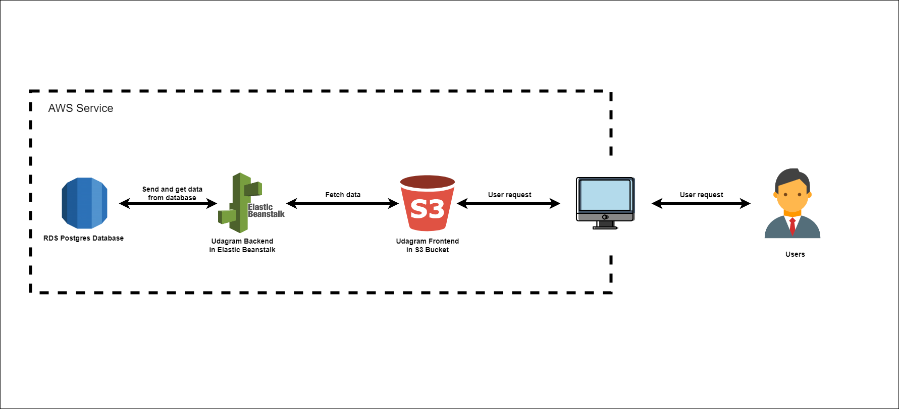

# Udagram Infrastructure

## AWS services
### S3 Bucket:

Used to deploy Front-end and storing file user upload to Udagram application

### Elastic Beanstalk:

Used to deploy back-end of Udagram application
### RDS:

Create postgres database for storing and getting data