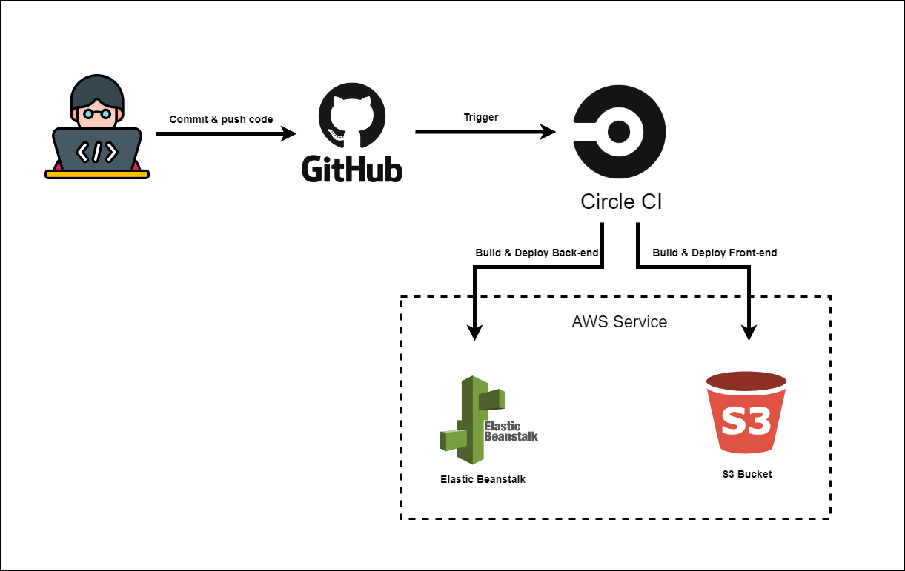

### Continuous Integration

#### Gitbub:

Storing source code, developers commit and push source into their git repository and link source code to CircleCI. When updating code Git will trigger CircleCI

### Circle Ci

When source code is updated on github, Circle Ci read file config.yml to build and deploy application
- Front end: run build and deploy to AWS S3
- Back end: run build and deploy to AWS Elastic Beanstalk

See config config.yml [here](./config.yml)